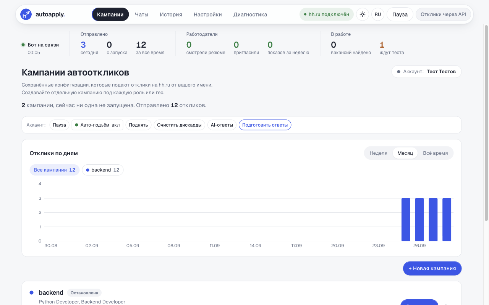
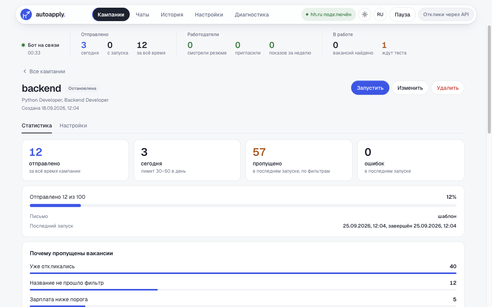
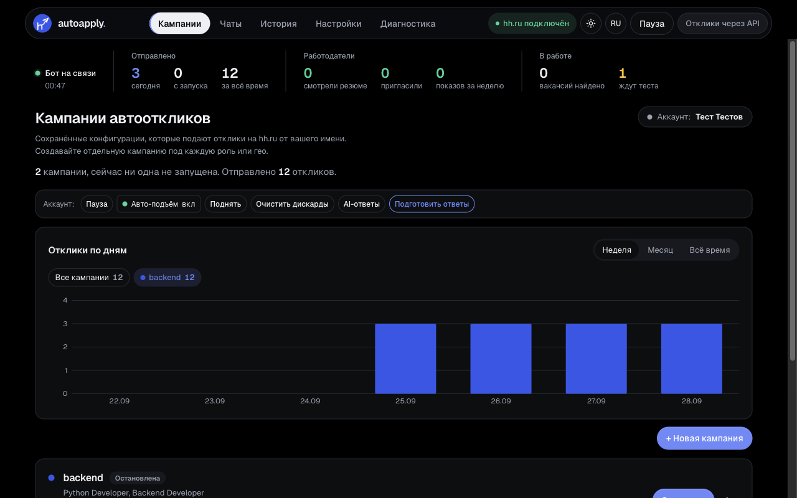
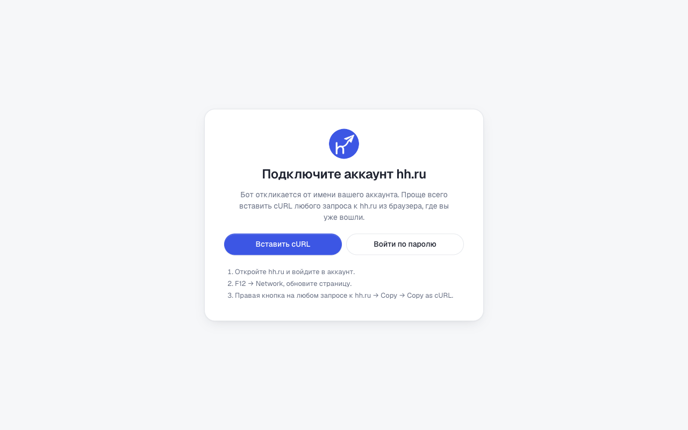

# hh-auto-apply

Бот для откликов на hh.ru. Собирает вакансии по поисковым запросам кампании, фильтрует их по стоп-словам и зарплате, пишет нейросетью сопроводительное письмо под каждую вакансию и откликается через API hh. Управление через веб-дашборд на `http://127.0.0.1:8000`.

Работает на macOS, Linux и Windows. Нейросеть на выбор: подписка Claude Code, подписка ChatGPT через Codex CLI или ключ OpenRouter.

Форк [hh.ru-clicker](https://github.com/Vlad9572324/hh.ru-clicker).

| Кампании и отклики по дням | Страница кампании |
|---|---|
|  |  |
|  |  |

Скриншоты сняты e2e-тестами на выдуманных данных.

## Для агента, который разворачивает

Шаги 3 и 5 требуют человека, остальное агент делает сам.

У человека нужно получить:

- куки hh.ru его аккаунта (шаг 3, он делает это сам в своём браузере);
- выбор нейросети: Claude Code, Codex или OpenRouter (шаг 4);
- поисковые запросы, стоп-слова, минимальную зарплату и опыт (шаг 5);
- ник в Telegram для писем (поле `tg` кампании).

Секреты (куки, ключи) не выводить в чат и в логи. Всё пользовательское лежит в `data/` и `.env`, оба в `.gitignore`.

## 1. Требования

| Что | Зачем |
|---|---|
| macOS, Linux или Windows 10/11 | на macOS и Windows компьютер не засыпает, пока идёт кампания |
| Python 3.11 | проверено на 3.11 |
| Одно из трёх: Claude Code (Pro/Max), Codex CLI (ChatGPT Plus/Pro) или ключ OpenRouter | письма и ответы работодателям |
| Аккаунт hh.ru с опубликованным резюме | от его имени идут отклики |

Docker-вариант (`docker-compose.yml`) остался от апстрима: внутри контейнера нет `claude` и `codex`, работает только OpenRouter.

## 2. Установка

macOS / Linux:

```bash
cd hh-auto-apply
python3.11 -m venv .venv
.venv/bin/pip install -r requirements.txt
cp .env.example .env
```

Windows (PowerShell или cmd):

```bat
winget install Python.Python.3.11
cd hh-auto-apply
py -3.11 -m venv .venv
.venv\Scripts\pip install -r requirements.txt
copy .env.example .env
```

`run.sh` и `run.bat` создают `.venv` сами при первом запуске, но при явной установке ошибки видно сразу. Главная зависимость — `curl_cffi`. Без неё hh.ru (DDoS-Guard) отвечает 403 с капчей: запросы к `*.hh.ru` уходят с TLS-отпечатком Chrome (`app/hh_transport.py`).

### Креды OAuth hh.ru

Отклики идут через API hh (настройка `use_oauth_apply`, шаг 5): так нет капчи. Для этого в `.env` нужны `client_id` и `client_secret` приложения HH Android. Это не личные данные: их извлекли из публичного APK, а здесь не хранят, чтобы не срабатывали сканеры секретов. Значения есть в апстриме, в [app/oauth.py](https://github.com/Vlad9572324/hh.ru-clicker/blob/main/app/oauth.py): вторые аргументы `os.environ.get("HH_OAUTH_CLIENT_ID", …)` и `os.environ.get("HH_OAUTH_CLIENT_SECRET", …)`. Скопировать их в `.env`:

```
HH_OAUTH_CLIENT_ID=...
HH_OAUTH_CLIENT_SECRET=...
```

Без них бот откликается через веб-форму hh, и там может появляться капча.

### Первый запуск

```bash
./run.sh          # macOS / Linux
run.bat           # Windows
```

Без аргумента поднимается только дашборд, Ctrl+C его останавливает. Первый запуск создаёт файлы в `data/`.

Дашборд открывается на `http://127.0.0.1:8000` и слушает только localhost. Другой адрес задаётся переменной `HOST` в `.env`, но тогда обязательно задать `DASHBOARD_PASSWORD` и `SESSION_SECRET`.

## 3. Аккаунт hh.ru (делает человек)

Вход по логину и паролю не используется, только по кукам из браузера.

1. Войти на hh.ru в обычном браузере.
2. Открыть DevTools (F12) → Network, обновить страницу. На любом запросе к `hh.ru`: правая кнопка → Copy → **Copy as cURL** (на Windows выбрать вариант `bash`).
3. В дашборде добавить аккаунт и вставить cURL целиком.

Бот проверит куки (нужны `hhtoken` и `_xsrf`) и подтянет имя и список резюме. Аккаунт сохраняется в `data/browser_sessions.json`.

Куки живут несколько недель. Когда в логе пошли ошибки авторизации, шаг повторяют: аккаунт обновится, дубль не появится.

## 4. Нейросеть: как включить и куда класть ключи

Нейросеть пишет сопроводительное письмо под каждую вакансию и черновики ответов работодателям в чатах. Без неё бот откликается с шаблонным письмом.

Настройка хранится в `data/config.json`, в поле `llm_profiles`: это список профилей. В режиме `fallback` бот берёт первый рабочий профиль и при ошибке переходит к следующему. Можно включить несколько: например, Claude первым, OpenRouter запасным.

Подписочные варианты (А и Б) запускают CLI без инструментов, MCP и пользовательских настроек (`app/llm.py`, класс `_SubscriptionCLI`): в промпт попадают тексты работодателей, и выполнить что-либо модель не сможет. Одно письмо пишется 5–30 секунд.

### Вариант А. Подписка Claude Code

1. Установить Claude Code:
   - macOS / Linux: `curl -fsSL https://claude.ai/install.sh | bash`
   - Windows (PowerShell): `irm https://claude.ai/install.ps1 | iex`
2. Войти: запустить `claude`, выполнить `/login`, войти аккаунтом с подпиской Pro или Max, выйти.
3. Проверить, что вызов без интерактива работает:
   ```bash
   echo "Скажи ok" | claude -p --model sonnet
   ```
4. Профиль: `{"name": "Claude Code", "base_url": "claude-cli", "model": "sonnet", "api_key": "cli", "enabled": true}`.

### Вариант Б. Подписка ChatGPT через Codex CLI

1. Установить Codex CLI: `npm install -g @openai/codex` (нужен Node.js; на macOS можно `brew install --cask codex`).
2. Войти: `codex login`, выбрать вход через ChatGPT, аккаунт с подпиской Plus или Pro.
3. Проверить:
   ```bash
   echo "Скажи ok" | codex exec --skip-git-repo-check --ephemeral -
   ```
4. Профиль: `{"name": "Codex", "base_url": "codex-cli", "model": "", "api_key": "cli", "enabled": true}`. Пустой `model` — модель Codex по умолчанию; конкретную можно вписать, как в `codex -m`.

### Вариант В. OpenRouter (платно, по ключу)

1. Зарегистрироваться на [openrouter.ai](https://openrouter.ai) через Google или почту.
2. Пополнить баланс: [openrouter.ai/settings/credits](https://openrouter.ai/settings/credits) → Add Credits. Хватит 5 $: модель ниже дешёвая, письмо стоит доли цента.
3. Создать ключ: [openrouter.ai/settings/keys](https://openrouter.ai/settings/keys) → Create Key. Имя любое, лимит расхода (Credit limit) лучше поставить, например 5 $. Ключ вида `sk-or-v1-…` показывают один раз, его нужно сразу скопировать.
4. Вписать ключ в `.env` в корне проекта:
   ```
   OPENROUTER_API_KEY=sk-or-v1-...
   ```
   В `config.json` сам ключ не пишется: профиль ссылается на переменную строкой `env:OPENROUTER_API_KEY`. После правки `.env` перезапустить `run.sh` / `run.bat`.
5. Профиль: `{"name": "OpenRouter", "base_url": "https://openrouter.ai/api/v1", "model": "google/gemini-3-flash-preview", "api_key": "env:OPENROUTER_API_KEY", "enabled": true}`. Другую модель можно выбрать на [openrouter.ai/models](https://openrouter.ai/models) и вписать её id в `model`.

### Включить профили

Проще всего в дашборде: Настройки → LLM → профили. Через API, при запущенном дашборде: сохранить тело в файл `profiles.json` (UTF-8) и отправить.

```json
{
  "mode": "fallback",
  "profiles": [
    {"name": "Claude Code", "base_url": "claude-cli", "model": "sonnet", "api_key": "cli", "enabled": true},
    {"name": "OpenRouter", "base_url": "https://openrouter.ai/api/v1",
     "model": "google/gemini-3-flash-preview", "api_key": "env:OPENROUTER_API_KEY", "enabled": true}
  ]
}
```

```bash
curl -s -X POST http://127.0.0.1:8000/api/llm_profiles -H "Content-Type: application/json" --data-binary "@profiles.json"
```

На Windows та же команда работает как `curl.exe` (есть в Windows 10/11). Тела запросов удобнее держать в файлах: кавычки в JSON прямо в командной строке PowerShell и cmd ломаются.

Тонкости:

- `api_key` у подписочных профилей — любая непустая строка (`cli`): профиль с пустым ключом бот пропускает.
- `base_url: "claude-cli"` и `"codex-cli"` — маркеры, по ним бот вызывает CLI вместо HTTP.

## 5. Общие настройки и кампании

### Рекомендуемые настройки

Каждая настройка — отдельный запрос `{"key": "...", "value": ...}` на `/api/settings`. На macOS / Linux:

```bash
s() { curl -s -X POST http://127.0.0.1:8000/api/settings -H 'Content-Type: application/json' -d "{\"key\":\"$1\",\"value\":$2}"; echo; }
s use_oauth_apply true      # отклики через API hh, без капчи
s stop_on_hh_limit true     # hh сообщил о лимите — остановиться
s pages_per_url 40
s max_concurrent 20
s response_delay 1
s batch_responses 3
# нейросеть в чатах: черновики ответов работодателям, без автоотправки (отдельный эндпоинт)
curl -s -X POST http://127.0.0.1:8000/api/llm_config -H 'Content-Type: application/json' -d '{"enabled": true, "auto_send": false}'
```

На Windows (PowerShell):

```powershell
function s($k, $v) { Invoke-RestMethod -Method Post -Uri http://127.0.0.1:8000/api/settings -ContentType 'application/json' -Body (@{key=$k; value=$v} | ConvertTo-Json) }
s use_oauth_apply $true; s stop_on_hh_limit $true; s pages_per_url 40; s max_concurrent 20
s response_delay 1; s batch_responses 3
Invoke-RestMethod -Method Post -Uri http://127.0.0.1:8000/api/llm_config -ContentType 'application/json' -Body '{"enabled": true, "auto_send": false}'
```

### Кампания (параметры даёт человек)

Кампания — это поисковый запрос, фильтры и лимиты, привязанные к аккаунту. Пример (значения условные, подставить свои), файл `campaign.json`:

```json
{
  "name": "backend",
  "account_idx": 0,
  "search_query": "Python Developer, Backend Developer",
  "salary_from": 200000,
  "experience": "between1And3",
  "schedule": "any",
  "employment": "any",
  "remote_only": true,
  "strict_title_match": true,
  "stop_words": "стажёр, стажер, intern, 1С, преподават",
  "daily_limit": 30,
  "daily_limit_max": 50,
  "total_limit": 100,
  "ai_cover_letter": true,
  "ai_answers": true,
  "gender": "none",
  "tg": "@username"
}
```

```bash
curl -s -X POST http://127.0.0.1:8000/api/campaigns -H "Content-Type: application/json" --data-binary "@campaign.json"
```

| Поле | Смысл |
|---|---|
| `search_query` | запросы через запятую, каждый ищется отдельно |
| `strict_title_match` | откликаться, только если слово из запроса есть в названии вакансии |
| `stop_words` | подстроки в названии, при которых вакансия пропускается; сюда же добавить текущего работодателя |
| `experience` | `noExperience`, `between1And3`, `between3And6`, `moreThan6` |
| `daily_limit` / `total_limit` | откликов в день / всего на кампанию; дневной лимит считается для каждой кампании отдельно |
| `ai_cover_letter` | письмо пишет нейросеть по резюме и тексту вакансии |
| `tg` | единственный контакт, который попадает в письмо |

Кампаний может быть несколько, по одной на направление. Список: `GET /api/campaigns`.

## 6. Запуск

```bash
./run.sh backend      # macOS / Linux
run.bat backend       # Windows
```

Аргумент — часть имени кампании. Скрипт (`run.py`) поднимает дашборд, запускает кампанию и раз в минуту проверяет статус. Когда кончается дневной лимит или вся кампания, сервер останавливается сам и пишет `Отклики на сегодня закончились`. На следующий день запустить снова.

## 7. Где смотреть

| Что | Где |
|---|---|
| Ход работы в реальном времени | дашборд, вкладка «Лог» |
| История откликов | дашборд, «История» → «Отклики»; файл `data/applied_vacancies.json` |
| Черновики ответов работодателям | дашборд, «LLM» → очередь подтверждения |
| Лог сервера | `data/server.log` |
| Подробный лог (письма, ошибки hh) | `data/debug.log` |

## 8. Если не работает

| Симптом | Причина и что делать |
|---|---|
| В `debug.log` строка `OAuth: не заданы HH_OAUTH_CLIENT_ID` | креды OAuth не прописаны в `.env`, см. шаг 2; после правки перезапустить |
| 403 и капча от hh | не установился `curl_cffi`: переустановить зависимости из `requirements.txt` |
| `claude -p exit 1` или `codex exec exit 1` в `debug.log` | не выполнен вход (`/login` или `codex login`) или кончился лимит подписки; проверить командой из шага 4. Если есть запасной профиль, бот переключится на него |
| Письма шаблонные, без нейросети | нет рабочего профиля: `llm_profiles` пуст, у профиля пустой `api_key` или `OPENROUTER_API_KEY` не прописан в `.env` (после правки `.env` нужен перезапуск) |
| Ошибки авторизации hh | куки устарели, повторить шаг 3 |
| `Кампания «X» не найдена` | имя не совпало, список: `curl -s http://127.0.0.1:8000/api/campaigns` |
| `Дашборд не запустился` | порт 8000 занят или ошибка импорта, смотреть `data/server.log` |
| Windows: `claude` или `codex` не найден | CLI не в `PATH` той консоли, где запущен `run.bat`; открыть новую консоль после установки |

## Тесты

Тесты поднимают отдельную копию дашборда на портах 8010–8011 с выдуманными данными из `e2e/fixtures/data/`. Наружу копия не ходит: запросы к hh.ru и вызовы `claude` / `codex` блокируются (`e2e/offline/sitecustomize.py`), так что реальный отклик из теста уйти не может. Ваши `data/` и `.env` не трогаются.

```bash
.venv/bin/pip install -r requirements-dev.txt
.venv/bin/python -m pytest e2e          # API и WebSocket: кампании, настройки, профили нейросети, история
.venv/bin/python e2e/run_ui.py          # интерфейс в браузере ego lite, скриншоты в e2e/screenshots/
```

UI-тесты гоняются в [ego lite](https://lite.ego.app/) (CLI `ego-browser`): вкладки, создание кампании через форму, график откликов, страница кампании, тёмная тема, мобильная ширина, ошибки JS, экран первого запуска. На время прогона окно ego lite выходит на передний план: перекрытое окно браузер не отрисовывает, и клики в нём зависают. `python e2e/stand.py` поднимает ту же копию для ручной проверки.

## Устройство

```
web_app.py            точка входа: .env → транспорт curl_cffi → FastAPI
run.py                дашборд + кампания + автоостановка по лимиту (все ОС)
run.sh, run.bat       готовят .venv и вызывают run.py
app/
  hh_transport.py     запросы к *.hh.ru через curl_cffi (отпечаток Chrome)
  manager.py          оркестратор: сбор вакансий, фильтры, лимиты, отклики
  hh_apply.py         отправка откликов, опросники
  oauth.py            токен OAuth hh из кук, отклики через API
  llm.py              профили нейросети: claude -p, codex exec, OpenAI-совместимые API
  hh_chat.py          переписка с работодателями
  routes/             HTTP API дашборда
static/               фронтенд дашборда: theme.css — оформление, campaigns.js — кампании, график, страница кампании
e2e/                  тесты: изолированный стенд, фикстуры, API и UI
data/                 всё пользовательское, не в git
```

Карта эндпоинтов hh.ru: [HH_API_MAP.md](HH_API_MAP.md). Решения: [docs/decisions/](docs/decisions/INDEX.md).
